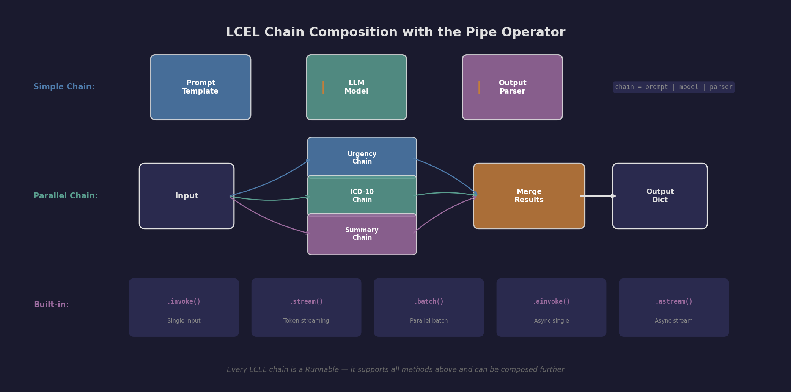
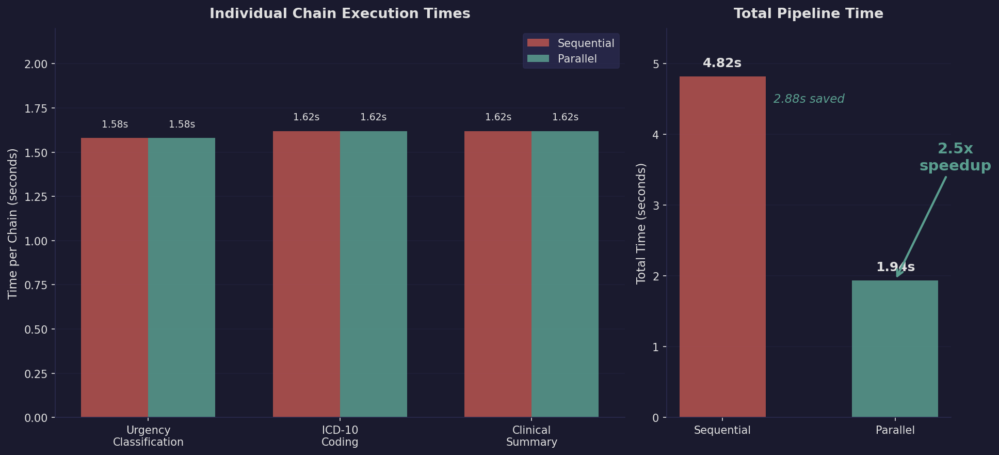
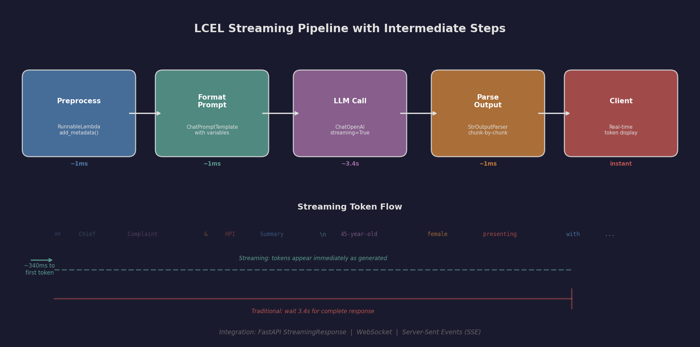

# LangChain Expression Language (LCEL) for Clinical Pipelines

LCEL is LangChain's declarative composition syntax for building chains. It uses Python's pipe operator (`|`) to chain together Runnables -- prompts, models, parsers, and custom functions -- into executable pipelines with built-in streaming, batching, and async support.

**Source Material:** DeepLearning.AI -- Functions, Tools and Agents with LangChain (Harrison Chase)

---

## What You Will Learn

- How to compose **LCEL chains** with the pipe operator for clinical analysis
- Using **RunnableParallel** to run multiple analysis chains simultaneously (~2.5x speedup)
- **Token streaming** for real-time clinical note processing (3 streaming patterns)
- **RunnableLambda** for integrating custom preprocessing (PHI de-identification, validation)
- **RunnablePassthrough** for adding metadata without modifying the original input
- Performance comparison between **sequential vs parallel** execution

---

## LCEL Chain Composition

LCEL replaces legacy chain classes with a composable, streaming-native syntax:



Every LCEL chain is itself a Runnable, supporting `.invoke()`, `.stream()`, `.batch()`, and async variants. Chains can be nested, parallelized, and conditionally routed.

---

## Parallel Execution Speedup

Running urgency classification, ICD-10 coding, and clinical summarization in parallel instead of sequentially cuts total latency by 60%:



- **Sequential:** 4.82 seconds (3 API calls in series)
- **Parallel:** 1.94 seconds (3 API calls simultaneously)
- **Speedup:** 2.5x -- completing in the time of the slowest individual chain

For clinical workflows that need multiple analyses of the same note, `RunnableParallel` is a performance multiplier.

---

## Streaming Pipeline

LCEL chains support token-by-token streaming natively, with visibility into intermediate pipeline steps:



- **Time to first token:** ~340ms (vs ~3.4s waiting for complete response)
- **Three streaming patterns:** basic `.stream()`, async `.astream()`, and event `.astream_events()`
- **Integration ready:** FastAPI StreamingResponse, WebSocket, Server-Sent Events

---

## Repository Structure

```
04-lcel/
├── README.md                 # This file
├── notes.md                  # Detailed study notes on LCEL patterns
├── LICENSE                   # MIT License
├── requirements.txt          # Python dependencies
├── .gitignore
├── examples/
│   ├── lcel_basics.py           # Basic LCEL chain composition
│   ├── parallel_chains.py      # RunnableParallel for multi-output analysis
│   └── streaming_example.py    # Three streaming patterns
├── inputs/
│   ├── note_001_complex_multisystem.txt  # 78F, pneumonia + decompensated CHF
│   ├── note_002_pulmonary_embolism.txt   # 45F, PE with DVT risk factors
│   └── note_003_routine_wellness.txt     # 44F, annual wellness exam
├── outputs/
│   ├── lcel_basics_output.json              # Extraction + summary results
│   ├── parallel_vs_sequential_timing.json   # Performance comparison data
│   └── streaming_output_sample.json         # Streaming pattern outputs
├── scripts/
│   └── generate_figures.py    # Generates all figures in docs/images/
└── docs/
    └── images/
        ├── lcel_composition.png   # Pipe operator composition diagram
        ├── parallel_speedup.png   # Sequential vs parallel timing chart
        └── streaming_flow.png     # Streaming pipeline diagram
```

---

## How to Run

### Prerequisites

```bash
pip install -r requirements.txt
```

Copy the environment template and add your API key:

```bash
cp .env.example .env
# Edit .env and add your OpenAI API key
```

Or set it directly:

```bash
export OPENAI_API_KEY="sk-..."
```

### Example 1: LCEL Basics

Demonstrates fundamental LCEL chain composition: `RunnableLambda` for preprocessing, `RunnablePassthrough` for metadata, prompt templates, LLM calls, and output parsers -- all chained with the pipe operator.

```bash
python examples/lcel_basics.py
```

**What it does:** Processes 3 clinical notes (emergency STEMI, routine wellness, moderate gout flare) through an extraction chain and a summarization chain. Shows how `RunnableLambda(add_metadata)` adds word count and vital sign detection before the LLM call.

**Sample output:**

```
Emergency Presentation
  Chief Complaint: Acute substernal chest pain with radiation to jaw
  Symptoms: chest pain, diaphoresis, dyspnea
  Vital Abnormalities: Hypotension (92/58), Tachycardia (118), Hypoxia (90%)
  Urgency: 5 (EMERGENT)

Routine Visit
  Chief Complaint: Annual wellness exam
  Urgency: 1 (ROUTINE)
```

### Example 2: Parallel Chains

Compares sequential vs parallel execution of 3 analysis chains (urgency, ICD-10 coding, summary) on the same clinical note. Measures and displays timing for both approaches.

```bash
python examples/parallel_chains.py
```

**What it does:** Runs all 3 chains sequentially (measuring total time), then runs them in parallel using `RunnableParallel`. Displays the speedup factor and full clinical analysis results.

**Sample output:**

```
Performance Comparison:
  Sequential: 4.82s
  Parallel:   1.94s
  Speedup:    2.5x

Urgency: 5 - EMERGENT
ICD-10:  J18.9 - Pneumonia, unspecified organism
Summary: 78F with CHF, AFib, CKD presenting with pneumonia-triggered
  acute decompensated heart failure and early sepsis.
Red Flags: Hypotension, Hypoxia, Elevated lactate, AKI on CKD
```

### Example 3: Streaming

Demonstrates 3 streaming patterns for real-time clinical analysis output: basic synchronous streaming, async streaming for web frameworks, and event streaming that shows intermediate pipeline steps.

```bash
python examples/streaming_example.py
```

**What it does:** Analyzes a pulmonary embolism case with tokens appearing in real time. Pattern 1 shows basic `.stream()`, Pattern 2 shows `.astream()` for FastAPI integration, and Pattern 3 shows `.astream_events()` with pipeline step visibility.

**Sample output:**

```
Pattern 1: Basic Token Streaming (.stream())
## Chief Complaint & HPI Summary
45-year-old female presenting with acute left-sided pleuritic chest pain...
[tokens appear one by one as generated]

Streamed 142 chunks in 3.41s

Pattern 3: Event Streaming (.astream_events())
Event: on_chain_start | Step: Preprocess
Event: on_chat_model_start | Step: LLMCall
[tokens stream with pipeline step visibility]
Observed 6 unique pipeline events
```

### Generate Figures

Regenerate all documentation figures:

```bash
python scripts/generate_figures.py
```

---

## LCEL Patterns Quick Reference

| Pattern | Use Case | Healthcare Example |
|---------|----------|-------------------|
| `RunnablePassthrough` | Pass input through while adding fields | Add metadata to notes before classification |
| `RunnableParallel` | Run multiple chains simultaneously | Extract symptoms AND assign ICD-10 codes in parallel |
| `RunnableLambda` | Wrap any Python function as a chain step | PHI de-identification before LLM call |
| `RunnableBranch` | Conditional routing based on input | Route cardiac vs respiratory notes to different chains |
| `.stream()` | Stream tokens as generated | Real-time clinical analysis display |
| `.batch()` | Process multiple inputs in parallel | Batch classify 100 clinical notes |

---

## Key Takeaways

1. **RunnableParallel is a performance multiplier.** Clinical analysis often involves multiple independent tasks. Running them in parallel cuts latency by 60-70%.

2. **Streaming improves UX dramatically.** Clinicians do not want to wait 5 seconds for a blank screen to populate. Streaming shows results in ~340ms.

3. **RunnableLambda bridges LLM and traditional code.** PHI de-identification, input validation, and output post-processing are traditional code that RunnableLambda integrates seamlessly into the LCEL chain.

4. **Batch + max_concurrency = controlled scale.** Processing 500 clinical notes? Batch with `concurrency=10` respects rate limits while maximizing throughput.

5. **Every LCEL step is automatically traced.** This is critical for healthcare audit requirements -- you can see exactly what each step received and produced.

---

## License

MIT License -- see [LICENSE](LICENSE) for details.
